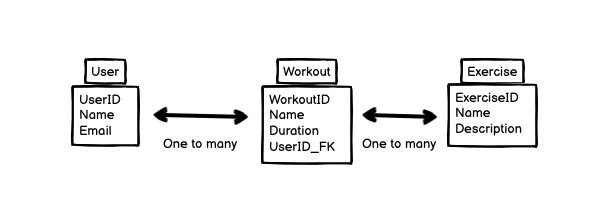

# Fit for me (Workout App) 

Tired of going to the gym and not knowing which work out you should. Why not check out, Fit For Me, an applcation that makes cataloguing  your workout simple and easy

## How it will work.

* The user will be able to add individual exercises to each work out.
* Add the time and amount of reps it took to complete
* User can read, edit, and delete these workouts, to complete the CRUD process.

## Technologies being used:
* Javascript
* HTML
* CSS 
* Node.js

## Wireframes

## ERDs

### Restful Route For Contacts
User Endpoints:
- GET /api/users: Retrieve a list of all users.
- GET /api/users/{userID}: Retrieve details of a specific user by their {userID}.
- POST /api/users: Create a new user.
- PUT /api/users/{userID}: Update details of a specific user by their {userID}.
- DELETE /api/users/{userID}: Delete a user by their {userID}.

Workout Endpoints:
- GET /api/workouts: Retrieve a list of all workouts.
- GET /api/workouts/{workoutID}: Retrieve details of a specific workout by its {workoutID}.
- POST /api/workouts: Create a new workout.
- PUT /api/workouts/{workoutID}: Update details of a specific workout by its {workoutID}.
- DELETE /api/workouts/{workoutID}: Delete a workout by its {workoutID}.

Exercise Endpoints:
- GET /api/exercises: Retrieve a list of all exercises.
- GET /api/exercises/{exerciseID}: Retrieve details of a specific exercise by its {exerciseID}.
- POST /api/exercises: Create a new exercise.
- PUT /api/exercises/{exerciseID}: Update details of a specific exercise by its {exerciseID}.
- DELETE /api/exercises/{exerciseID}: Delete an exercise by its {exerciseID}.

## User Stories
* 1. As a user, i want to custom make my workout for the day before i go to the gym.
* 2. As a user, I want to be able to add the amount of reps and sets i do during each workout. i also want add the time it took me as well
* 3. As a user, i would like an app that is easy and simple to use so as to not interrupt my work to much

##  MVP 
* Be able to add, delete and edit workouts 
* Be able to add times to already added work outs and sets
* Allow users to register and log in to the application.
* Create, Read, Update, and Delete (CRUD) for Exercises: Users should be able to:
* * Create new exercises with a name and description.
* * View a list of all exercises.
* * View the details of a specific exercise.
* * Update the details of an existing exercise.
* * Delete an exercise.

## Stretch Goals
* Tracking: Create a log model to track and store the data
* User Authentication:
* Workout Categories: Add the ability to categorize workouts (e.g., cardio, strength training, yoga) and allow users to filter or search workouts by category.
* Timer